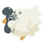
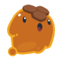
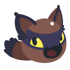
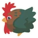
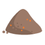

|  | Slime | Diet | Favorite | Toys |
| :---: | :---: | :---: | :---: | :---: |
|  1 |  |  | — |  |
|  2 |  |  |  |  |
|  3 |  |  |  |  |
|  4 |  |  |  | — |
|  5 |  |  |  |  |
|  6 |  |  |  | — |
|  7 |  |  |  |  |
|  8 |  |  |  |  |
|  9 |  |  | — |  |
| 10 |  |  |  |
| 11 |  |  |  | — |
| 12 |  |  | — |  |
| 13 |  |  |  | — |
| 14 |  |  |  | — |
| 15 |  |  | — | — |
| 16 |  |  | — | — |
| 17 |  | — | — | — |
| 18 |  |  |  |  |
| 19 |  |  |  |  |
| 20 |  |  |  |  |
| 21 |  | — | — | — |
| 22 |  |  |  |  |
| 23 |  |  |  |  |
| 24 |  |  |  |  |